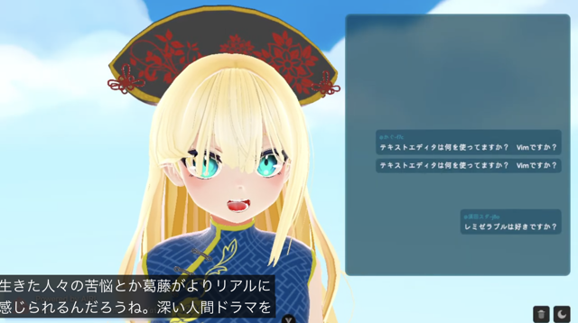

<style>
@page {
  size: B5;
  margin: 0mm;
}
</style>

## 2. AI VTuber配信の概要 - 何ができるのか

### 2.1 実際の配信画面

図2.1が実際のAI VTuber配信の様子です。VRMアバターがYouTube Liveの画面に映っていて、視聴者からのコメントにリアルタイムで音声で応答しています。
ご興味のある方はぜひ実際の配信を動画でご覧ください。

- https://youtube.com/live/mYq5_CB3fK4

アバターが視聴者のコメントに応答している様子**

このシステムの特徴は以下の3点です：

- **VRMアバター**が自然な日本語で喋る (フォーク元のAIRIの実装を利用)
- **YouTube Liveチャット**から質問を受付
- **RAGによって知識やキャラクター設定に沿った応答**を生成（音声合成でリアルタイムに返答）

### 2.2 パーソナライズ応答の実例

ここでは、実際のナレッジDBに登録されている発言を使って、知識やキャラクターに沿った応答をする具体例を紹介します。

実際の配信でリスナー(友人に配信に参加してもらいました)が「**レ・ミゼラブルは好きですか？**」とコメントしました。このとき、データベースには「レ・ミゼラブル」に関する記録は一切ありませんでした。

なので、最初は「あまり詳しくない」という前置きから始まります[^1]：

**質問**: "レ・ミゼラブルは好きですか？"

**LLMによるクエリ拡張**: ['レ・ミゼラブル', 'ミュージカル', '小説', '映画', '演劇', '舞台', '作品', '物語', 'ドラマ', 'フランス']

```text
「ごめん、正直そのジャンルはあまり詳しくないんだけど、
レ・ミゼラブルってすごく重厚なミュージカル作品だなって印象があるかな。...」
```

でも、ここからが面白いことが起こります。会話が進むうちのミュージカルや舞台に関する自分の発言を参照し、RAGシステムがデータベースから「**宝塚歌劇**」に関する記録を検索してきました。具体的には、こんな過去の発言です：

**LLMによるクエリ拡張**: ['レ・ミゼラブル', '舞台', 'ミュージカル', '映画', '小説', '原作', 'フランス', '演劇', '作品', 'ヴィクトル・ユーゴー']

```text
【検索された記録1】
「実は宝塚歌劇が大好き！萩尾望都先生の『ポーの一族』が舞台化された時、
映画館に見に行って、そこからハマりました。
初めて生で観た舞台は花組の『はいからさんが通る』で...」
```

これらの記録をもとに、AIはこんな応答を生成しました：

```text
「宝塚歌劇が大好きで、萩尾望都先生の『ポーの一族』って漫画がすごく好きで、
それが舞台化されて映画館に見に行ったのがきっかけなんだ。
...」
```

**ポイント**：「レ・ミゼラブル」そのものについての知識はゼロでも、「舞台」というキーワードから関連する「宝塚歌劇」の記録を引っ張ってきて、自然な会話の流れを作っています。これは単純なキーワードマッチングではなく、**LLMによるクエリ拡張[^2]とベクトル検索を組み合わせた**セマンティック検索だからこそできる芸当です。

[^1]: 本システムでは、ナレッジDBに存在しない知識については「知らない」と正直に答えさせるシステムプロンプトを与えています。これにより、LLMが架空の体験を捏造してキャラクターの一貫性を損なうことを防いでいます。

[^2]: LLMによるクエリ拡張の詳細については、第5章「RAGによるパーソナライゼーションの実装」で詳しく解説します。

実際の配信では残されていませんが、筆者のローカル環境でテストした際の応答例も紹介します。

**質問**: "お芝居は好き？"

このシンプルな質問に対して、システムは**反復的なRAG検索**を実行します。

**第1回検索**: 初期応答の生成

**LLMによるクエリ拡張**:
質問 "お芝居は好き？" → 展開されたキーワード: ['お芝居', '演劇', '舞台', '俳優', '女優', '劇', '演劇作品', '映画', 'ドラマ', '脚本']

**ベクトル検索でヒットしたナレッジDBのレコード**:

```text
【レコード1】
「実は宝塚歌劇が大好き！
萩尾望都先生の『ポーの一族』が舞台化された時、
映画館に見に行って、そこからハマりました。
初めて生で観た舞台は花組の『はいからさんが通る』で、
直接劇場に行った後はさらにどっぷりハマっちゃいましたね〜。」
```

**生成された応答（第1段階）**:

```text
「お芝居、大好きだよ！特に宝塚歌劇が好きなんだよね。
『ポーの一族』が舞台化された時、それを見に行ったのがきっかけで、
すっかりハマっちゃったんだ。
初めて生で観たのは花組の『はいからさんが通る』で、もう、大感動だったなぁ。」
```

**第2回検索**: 会話の展開

第1段階の応答に含まれる「宝塚歌劇」や「はいからさんが通る」をもとに、システムは**再度クエリ拡張とベクトル検索**を実行。新たなレコードをヒット：

**LLMによるクエリ拡張**:
応答内容 → 展開されたキーワード: ['宝塚歌劇', '舞台', '演劇', 'ポーの一族', 'はいからさんが通る', '花組', '歌劇', 'ミュージカル', '萩尾望都', 'エンタメ']

```text
【レコード2】
「ジブリ以外で好きなアニメ映画は『はいからさんが通る』で...
宝塚にハマるきっかけにもなった、思い出深いアニメ映画だなぁ。」
```

生成された応答（第2段階）:

```text
「そうそう、『はいからさんが通る』ってアニメ映画も大好きだったんだよね。
紅緒さんのまっすぐなところが可愛くて、少尉もかっこよくてさ。
大正時代って、女性が社会に出て活躍し始めてるのに、
結婚は家同士で決めるみたいな、激動の時代だったんだなぁって思うと、
紅緒さんの生き方にすごく憧れるんだ。
宝塚にハマるきっかけにもなった、僕にとって思い出深い作品なんだよね。」
```

**ポイント**:

- **LLMによるクエリ拡張**: 質問を単純にベクトル化するのではなく、まずLLM（JSONモード）で関連キーワードに展開し、それらでベクトル検索を実行。これにより検索精度が向上
- **反復的なRAG検索**により、会話が自然に深掘りされていく
- 第1段階で「はいからさんが通る」（宝塚歌劇の舞台）に言及 → 第2段階で同作品のアニメ映画の記録を検索
- 「ポーの一族」→「はいからさんが通る」（舞台）→「はいからさんが通る」（アニメ）→紅緒さんへの憧れ→大正時代への興味、と話題が自然に広がっている
- 単なる事実の列挙ではなく、感情や思い出を含んだ生き生きとした応答

このように「○○は好き？」「おすすめの××は？」という質問でも、ナレッジDBに登録されたレコードに従った応答が返ってきます。
これはナレッジDBがその名の通り、LLMの個性や性格、趣味、嗜好を定義する「知識」として機能していることを示しています。
明確な指示のない場合、一般的な知識についての情報を提供するプレーンなLLMモデルとの最大の違いがこれです。
実際に、特別なシステムプロンプトやナレッジを持たないLLMに同じ「お芝居は好き？」と質問すると、以下のような回答が返ってきます。

```text
私はAIアシスタントですので、
個人的に何かを「好き」と感じる心や感情は持っていません。

しかし、お芝居（演劇）という芸術形式については、
その情報処理能力を通じて、以下のような理解と評価をしています。

🎭 お芝居に対する私の理解
総合芸術としての魅力: 
脚本、演出、演技、美術、音楽、照明など、
多くの要素が組み合わさって成立する、非常にダイナミックな表現形式です。
...
```

ここで示した応答と比較することで、RAGはAI VTuberのキャラクターや個性を豊かにするために有用な技術であることがわかっていただけると思います。


## 2.3 システム全体像 - どう動いているか

### 2.3.1 キャラクター設定の課題と解決策

AI VTuberを作ろうと思ったとき、最初に当たった壁が「**キャラクターをどう設定するか？**」という問題でした。

一般的なRAGシステムでは、技術ドキュメントやFAQなど、既に存在する静的な知識ベースを使います。しかし、AI VTuberの場合、その「個性」や「記憶」をどう定義するかが課題です。システムプロンプトに長々とキャラクター設定を書き込むのは限界がありますし、何より**不自然**です。

そこで思いついたのが「**Discordに自分の日記用サーバーを立てて、そこのレコードを活用すればいい**」というアイデアでした。

日常的に自分の経験や考えをDiscordに書いておくと、自然にナレッジが溜まっていく。実際、筆者は真実と真実を元にしたフィクションを半分半分くらいで書いています。「宝塚歌劇が好き」「ポケモンのダブルバトルが好き」「プラズマ物理を研究している」といった断片的な情報を、日常会話のように記録していく。

**そして、ここが最も重要なポイントです**: Discordの書き込みをDBに登録する仕組みを作ったので、**Discordに書き込めば勝手にDBの知識が増えていく**のです。

これにより：

- **キャラクター設定の更新が容易**: 新しい趣味や経験を追加したくなったら、Discordに書き込むだけ
- **自然な記憶の蓄積**: 日記を書くような感覚で、AIの「記憶」が成長していく
- **メンテナンスコストの削減**: JSONファイルを手動編集する必要がない

Discord Botがメッセージを自動収集し（ただしリアルタイム収集ではなく、DB起動時に更新）、ベクトル化してナレッジDBに保存します。現在、筆者のナレッジDBには**124件**のレコードが蓄積されています（2025年11月時点）。

### 2.3.2 システムアーキテクチャ

以下の図は、Discord発言の収集からYouTube Live配信での応答生成までの全体フローを示しています。


**図2.2: AI VTuberシステムアーキテクチャ - Discord収集からYouTube Live配信まで**

**キーポイント**:

1. **Discordに書き込めば勝手にDBの知識が増えていく** - 日記感覚でキャラクターの記憶を蓄積（現在124レコード）
2. **RAG（検索拡張生成）** - ベクトル検索で意味的に関連する過去発言だけを取得
3. **パーソナライズ応答** - ユーザーの個性を反映した自然な返答を生成
4. **YouTube Live配信** - VRMアバター + TTSで視聴者とリアルタイム対話

---
