<style>
@page {
  size: B5;
  margin: 0mm;
}
</style>

## 3. システム全体像 - どう動いているか

### 3.1 キャラクター設定の課題と解決策

AI VTuberを作ろうと思ったとき、最初に当たった壁が「**キャラクターをどう設定するか？**」という問題でした。

一般的なRAGシステムでは、技術ドキュメントやFAQなど、既に存在する静的な知識ベースを使います。しかし、AI VTuberの場合、その「個性」や「記憶」をどう定義するかが課題です。システムプロンプトに長々とキャラクター設定を書き込むのは限界がありますし、何より**不自然**です。

そこで思いついたのが「**Discordに自分の日記用サーバーを立てて、そこのレコードを活用すればいい**」というアイデアでした。

日常的に自分の経験や考えをDiscordに書いておくと、自然にナレッジが溜まっていく。実際、筆者は真実と真実を元にしたフィクションを半分半分くらいで書いています。「宝塚歌劇が好き」「ポケモンのダブルバトルが好き」「プラズマ物理を研究している」といった断片的な情報を、日常会話のように記録していく。

**そして、ここが最も重要なポイントです**: Discordの書き込みをDBに登録する仕組みを作ったので、**Discordに書き込めば勝手にDBの知識が増えていく**のです。

これにより：

- **キャラクター設定の更新が容易**: 新しい趣味や経験を追加したくなったら、Discordに書き込むだけ
- **自然な記憶の蓄積**: 日記を書くような感覚で、AIの「記憶」が成長していく
- **メンテナンスコストの削減**: JSONファイルを手動編集する必要がない

Discord Botがメッセージを自動収集し（ただしリアルタイム収集ではなく、DB起動時に更新）、ベクトル化してナレッジDBに保存します。現在、筆者のナレッジDBには**124件**のレコードが蓄積されています（2025年11月時点）。

### 3.2 システムアーキテクチャ

図3.1は、Discord発言の収集からYouTube Live配信での応答生成までの全体フローを示しています。



**図3.1: AI VTuberシステムアーキテクチャ - Discord収集からYouTube Live配信まで**

**キーポイント**:

1. **Discordに書き込めば勝手にDBの知識が増えていく** - 日記感覚でキャラクターの記憶を蓄積（現在124レコード）
2. **RAG（検索拡張生成）** - ベクトル検索で意味的に関連する過去発言だけを取得
3. **パーソナライズ応答** - ユーザーの個性を反映した自然な返答を生成
4. **YouTube Live配信** - VRMアバター + TTSで視聴者とリアルタイム対話

### 3.3 技術スタック

#### Discord統合

- **Discord.js**: Discord API クライアント
- **Node.js**: メッセージ収集・応答生成サービス

#### データベース・検索

- **PostgreSQL 17**: メインデータベース
- **pgvector (v0.4.0)**: ベクトル検索拡張（Rustベース、高速）
- **Drizzle ORM**: 型安全なデータベース操作
- **HNSW インデックス**: 高速近似最近傍探索（16倍高速化）

#### AI/ML

- **LLM**: OpenRouter経由でマルチプロバイダー対応
  - Claude 3.5 Sonnet（推奨）
  - GPT-4, Gemini等
- **Embeddings**: OpenAI text-embedding-3-small
  - 1536次元ベクトル
  - コスト: $0.00002/1000トークン（激安）

#### VTuber配信

- **YouTube Data API v3**: ライブチャット取得
- **VRM**: 3Dアバター表示
- **TTS**: ElevenLabs（音声合成）
- **OBS**: 配信ソフト + Browser Source

### 3.4 既存インフラの活用

**重要な設計判断**: 新規テーブル作成せず既存を活用

AIRI本体の`memory_fragments`テーブルを流用：

- 元々はTelegram Botの会話記憶用
- `metadata`フィールド（JSONB）でプラットフォーム判別可能
- 複数のベクトル次元に対応済み

```typescript
// packages/telegram-bot/src/db/schema.ts (既存)
export const memoryFragmentsTable = pgTable('memory_fragments', {
  id: uuid().primaryKey(),
  content: text().notNull(),
  category: text().notNull(),  // 'tech', 'hobby', 'game'等
  metadata: jsonb().default({}), // { source: 'discord', authorId: '...' }
  content_vector_1536: vector({ dimensions: 1536 }),
  // ...
})
```

→ 開発期間短縮、インフラ構築不要

---
